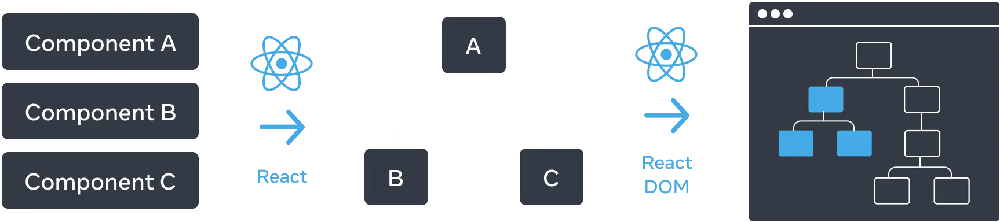
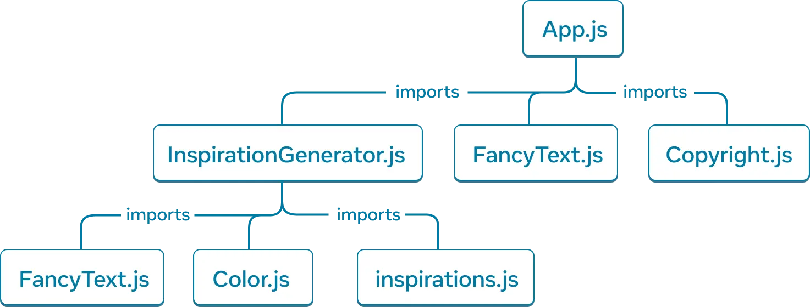

# React UI as a Tree
A React application can be visualized as a tree structure with the root component at the top and child components at several underneath it. 

## The Render Tree
A React UI forms a tree structure much like HTML does with parent and child elements. A root component contains child components that can have children of their own.

The render tree in React represents a single render pass-through. If a React application features conditional rendering, the render tree will only represent those components/UI that render for a single pass-through. This tree structure can be seen below:

React organizes components into a tree

Top-level components in react are those closest to the root component. These components tend to be the most complex.

Components at the bottom of the render tree, especially leaves (those that have no children) tend to be the simplest. Leaf components are frequently re-rendered, as they are subject to the re-rendering of all parent components.

## Module Dependency Tree
Components can import components, functions, and constants from modules. These *dependencies* can be modeled as a tree in a similar fashion to the the render tree:

[

](https://react.dev/_next/image?url=%2Fimages%2Fdocs%2Fdiagrams%2Fmodule_dependency_tree.dark.png&w=1920&q=75)

Each node in this tree represents a file. Each child represents an import statement. 

Tools called bundlers are used to compile all the JavaScript code needed to run a particular React application.

As the numbers of imports grows, the size of your bundled application with all its dependencies increases. Large bundles can be expensive and degrade performance.